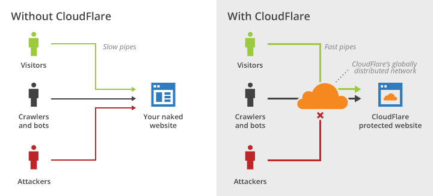

Souhaitant me mettre aux [Service Workers](https://developer.mozilla.org/fr/docs/Web/API/Service_Worker_API/Using_Service_Workers), notamment pour remplacer [appcache](https://developer.mozilla.org/fr/docs/Utiliser_Application_Cache) pour le support _offline_ de mon jeu [esviji](https://esviji.com/), j'avais besoin de passer en HTTPS. [Let's Encrypt](https://letsencrypt.org/) étant à l'époque toujours en _beta_, et les tutoriels de mise en œuvre pas légion et peu compréhensibles, j'avais choisi la solution de facilité avec [CloudFlare](https://www.cloudflare.com/), que je quitte aujourd'hui pour mes propres certificats Let's Encrypt sur mon hébergement mutualisé [AlwaysData](https://www.alwaysdata.com/fr/).

CloudFlare est un service qui fonctionne comme un proxy pour le site, avec beaucoup de fonctionnalités destinées à améliorer la performance et la sécurité, dont notamment la mise en place de HTTPS. Rien à faire sur le site, qui peut rester en HTTP, il faut juste faire pointer les DNS chez CloudFlare plutôt que chez l'hébergeur du site. Et quand même bien parcourir les nombreuses options de configuration dans tous les sens, pour bien choisir exactement ce que l'on veut.



J'ai oublié de préciser que l'[offre de base](https://www.cloudflare.com/plans/), qui inclue le HTTPS, est gratuite, difficile de faire plus compétitif !

Pourtant, la magie a ses limites, et si je suis convaincu que CloudFlare peut faire beaucoup de bien à des sites pas spécialement optimisés, il n'a pas beaucoup de sens pour un site où les optimisations de performance sont déjà très poussés, comme chez moi. L'effet peut même être inverse, puisque l'on perd une grande partie du contrôle, notamment sur les en-têtes associées aux requêtes HTTP. J'ai donc choisi de quitter CloudFlare.

J'ai été d'autre part largement motivé par la stabilisation de Let's Encrypt, et surtout l'apparition d'[un tutoriel Let's Encrypt dédié à mon hébergeur AlwaysData](http://forum.alwaysdata.com/viewtopic.php?id=4631), utilisant le client [simp_le](https://github.com/kuba/simp_le).

J'ai ainsi pu mettre en place un certificat Let's Encrypt sur [https://nicolas-hoizey.com/](https://nicolas-hoizey.com/) en moins d'une heure, et je n'ai plus qu'à faire de même sur [https://esviji.com/](https://esviji.com/) et [https://play.esviji.com/](https://play.esviji.com/).

Je précise juste qu'il faut prendre une IP fixe pour pouvoir mettre du SSL, soit 5 € par mois en plus de votre tarif d'hébergement.

Une astuce à connaître, enfin, si vous êtes aussi sur AlwaysData. Si vous voulez rediriger tout le trafic HTTP vers le HTTPS, vous trouverez sans doute ce type de configuration Apache dans des docs en ligne :

```apache
RewriteCond %{HTTPS} !=on
RewriteRule ^(.*) https://nicolas-hoizey.com/$1#s [QSA,R=301,L]
```

Il se trouve que la `RewriteCond` ne fonctionne pas chez AlwaysData, où il faut plutôt utiliser celle-ci :

```apache
RewriteCond %{HTTP:X-Forwarded-Proto} !https
RewriteRule ^(.*) https://nicolas-hoizey.com/$1 [QSA,R=301,L]
```

Un grand merci à Martin pour le tutoriel, et Héloïse pour l'aide sur la bonne configuration Apache pour les redirections.
